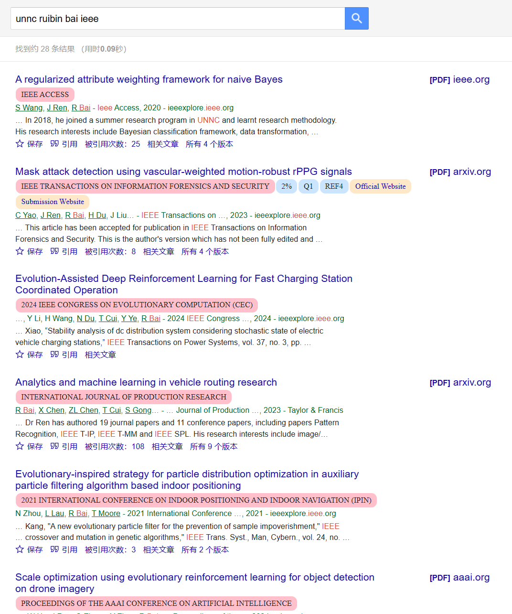

# Plugins

## Easy Scholar for UNNC

1. `git clone https://github.com/DjyBrandon/plugins.git`
2. Drag the `Easy Scholar for UNNC` folder to Chrome extension
3. Search sth. in Google Scholar and the result will show the paper and score that exists in the UNNC ESI Journal List

